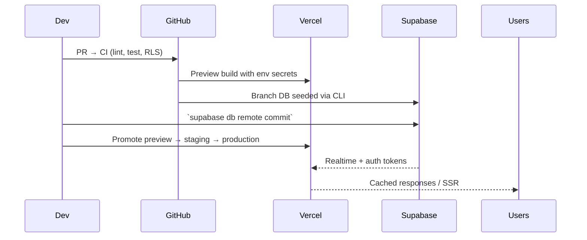

# Architecture Overview

The Ibimina platform is a monorepo housing Staff Admin web and desktop
applications along with Supabase backend assets. This document summarises the
production architecture.

## High-Level Components

1. **Staff Admin Applications**
   - `apps/pwa/staff-admin`: Staff/admin console (Next.js 15 App Router, React
     Server Components) containerized for Node runtime on port 3100.
   - `apps/desktop/staff-admin`: Staff/admin desktop app (Tauri + Vite + React)
     for offline-capable workflows.

2. **Backend Services**
   - Supabase Postgres with `app`, `identity`, and `operations` schemas
     protected by RLS. Materialized views surface dashboard aggregates.
   - Supabase Edge Functions (`supabase/functions/*`) handle telecom callbacks,
     reconciliation jobs, and secure exports with HMAC signatures.

3. **Shared Packages**
   - `packages/admin-core`: Admin core business logic
   - `packages/config`: Environment configuration
   - `packages/flags`: Feature flag management
   - `packages/lib`: Shared utilities
   - `packages/locales`: i18n translations
   - `packages/supabase-schemas`: Database type definitions
   - `packages/ui`: Shared React components

4. **Observability & Tooling**
   - GitHub Actions pipeline runs lint/tests/RLS proofs.
   - Prometheus + Grafana stack (see `infra/metrics/`) captures metrics.

## Deployment Flow

## Data Flows

- **Authentication**: Staff use Supabase Auth; server components hydrate session
  context via `@supabase/ssr`. RLS ensures tenant isolation for SACCO data.
- **Payments**: Telecom callbacks land in `supabase/functions/ingest-sms` and
  `parse-sms`; they write to reconciliation tables and trigger notifications.
- **Reporting**: Materialised views (`app.member_aggregates`,
  `app.payment_rollup`) served through RPC endpoints consumed by admin
  dashboards.

## Operational Concerns

- **Configuration**: Environment matrices maintained in `docs/ENVIRONMENT.md`.
- **RLS Proofs**: SQL tests in `supabase/tests/rls` executed on every merge.
- **Runbooks**: Deployment and incident response covered in `docs/` directory.

This architecture is stable, reproducible across environments, and backed by the
runbooks and verification procedures referenced above.
