# 🎉 IBIMINA SYSTEM - READY FOR TESTING

**Date:** November 4, 2025  
**Status:** ✅ All Critical Issues Fixed - Ready for Comprehensive Testing

---

## ✨ WHAT WAS ACCOMPLISHED

### 1. Fixed Supabase Migration Issues ✅

- **Problem:** `has_role` function referenced non-existent `staff_members` table
- **Solution:** Created `has_admin_role` function using `org_memberships` table
- **Result:** All 116 migrations now apply successfully
- **Status:** ✅ Deployed to production Supabase

### 2. Created Comprehensive Testing Guide ✅

- **File:** `TESTING_GUIDE.md`
- **Coverage:** 40-point testing checklist across all apps
- **Phases:** Backend (3 tests), Admin PWA (7 tests), Client Mobile (14 tests),
  Staff Android (13 tests), Integration (3 flows)
- **Includes:** Step-by-step instructions, bug reporting template,
  troubleshooting guide

### 3. All Code Synced to GitHub ✅

- **Branch:** `main`
- **Commits:** All fixes committed and pushed
- **Files Updated:**
  - `supabase/migrations/20250203120000_metrics_anomaly_samples.sql`
  - `TESTING_GUIDE.md`
  - This summary file

---

## 🏗️ SYSTEM ARCHITECTURE OVERVIEW

```
┌─────────────────────────────────────────────────────────────┐
│                     IBIMINA ECOSYSTEM                        │
├─────────────────────────────────────────────────────────────┤
│                                                               │
│  ┌──────────────┐    ┌──────────────┐    ┌───────────────┐ │
│  │  Admin PWA   │    │Client Mobile │    │Staff Android  │ │
│  │              │    │              │    │               │ │
│  │  - Next.js   │    │- React Native│    │- Capacitor    │ │
│  │  - PWA       │    │- iOS/Android │    │- Android Only │ │
│  │  - Offline   │    │- WhatsApp OTP│    │- QR Auth      │ │
│  │  - Dashboard │    │- Transactions│    │- NFC TapMoMo  │ │
│  └───────┬──────┘    └───────┬──────┘    └───────┬───────┘ │
│          │                   │                    │          │
│          └───────────────────┼────────────────────┘          │
│                              │                               │
│                    ┌─────────▼─────────┐                    │
│                    │    SUPABASE       │                    │
│                    │                   │                    │
│                    │ - PostgreSQL      │                    │
│                    │ - 30 Edge Functions│                   │
│                    │ - RLS Policies    │                    │
│                    │ - Real-time       │                    │
│                    └───────────────────┘                    │
│                                                               │
└─────────────────────────────────────────────────────────────┘
```

---

## 🚀 QUICK START FOR TESTING

### Step 1: Verify Backend (5 min)

```bash
cd /Users/jeanbosco/workspace/ibimina

# Test Supabase connection
curl -X GET "https://vacltfdslodqybxojytc.supabase.co/rest/v1/" \
  -H "apikey: eyJhbGciOiJIUzI1NiIsInR5cCI6IkpXVCJ9..." | jq
```

### Step 2: Start Admin PWA (2 min)

```bash
cd /Users/jeanbosco/workspace/ibimina

# Start admin app
pnpm --filter @ibimina/admin dev

# Open browser
open http://localhost:3100
```

### Step 3: Build Client Mobile (10 min)

```bash
cd /Users/jeanbosco/workspace/ibimina/apps/client-mobile

# iOS
npx cap sync ios && npx cap open ios

# Android
npx cap sync android && npx cap open android
```

### Step 4: Build Staff Android (10 min)

```bash
cd /Users/jeanbosco/workspace/ibimina/apps/admin/android

# Build APK
./gradlew assembleDebug

# Install
adb install app/build/outputs/apk/debug/app-debug.apk
```

---

## 📊 SYSTEM STATUS

| Component         | Status      | Tests | Notes                       |
| ----------------- | ----------- | ----- | --------------------------- |
| **Backend**       | ✅ Ready    | 0/3   | Migrations deployed         |
| **Admin PWA**     | ✅ Ready    | 0/7   | Runs on localhost:3100      |
| **Client Mobile** | ✅ Ready    | 0/14  | iOS + Android builds ready  |
| **Staff Android** | ✅ Ready    | 0/13  | APK builds successfully     |
| **Integration**   | ⚠️ Untested | 0/3   | Requires end-to-end testing |

**Overall:** 🟡 Ready for Testing (0/40 tests completed)

---

## 🎯 TESTING PRIORITIES

### Priority 1: Critical Path (Must Pass) 🔴

1. **WhatsApp OTP Authentication** (Client Mobile)
   - Required for all users to sign up
   - Test on both iOS and Android
2. **Payment Processing** (Integration)
   - Client deposits → Staff processes → Balance updates
   - This is the core business flow

3. **Admin Dashboard** (Admin PWA)
   - Staff need to view transactions and manage users

### Priority 2: Key Features (Should Pass) 🟠

4. **SMS Reconciliation** (Staff Android + Backend)
   - Auto-matching of MoMo SMS to users
5. **QR Code 2FA** (Staff Android → Admin PWA)
   - Staff authentication for web console

6. **Offline Mode** (All Apps)
   - Must queue actions and sync when back online

### Priority 3: Nice to Have (Can Fix Later) 🟡

7. **NFC TapMoMo** (Staff Android)
   - Alternative payment method (Android only)

8. **Push Notifications** (All Mobile Apps)
   - Real-time alerts

9. **Dark Mode** (All Apps)
   - UI preference

---

## 📝 TESTING WORKFLOW

Follow this exact sequence:

```mermaid
graph TD
    A[Read TESTING_GUIDE.md] --> B[Phase 1: Backend Testing]
    B --> C[Phase 2: Admin PWA Testing]
    C --> D[Phase 3: Client Mobile Testing]
    D --> E[Phase 4: Staff Android Testing]
    E --> F[Phase 5: Integration Testing]
    F --> G{All Tests Pass?}
    G -->|Yes| H[✅ Ready for Production]
    G -->|No| I[Fix Bugs]
    I --> J[Re-test Failed Tests]
    J --> G
```



### For Each Test:

1. Follow steps in `TESTING_GUIDE.md`
2. Mark checkbox as ✅ (pass) or ❌ (fail)
3. If fail, create GitHub issue with bug report
4. Continue to next test

---

## 🐛 BUG REPORTING PROCESS

When you find a bug:

1. **Open GitHub Issue**

   ```
   Title: [App] Brief description
   Example: [Client Mobile] WhatsApp OTP not sending on iOS
   ```

2. **Use Bug Template** (from TESTING_GUIDE.md)
   - Severity (Critical/High/Medium/Low)
   - Steps to reproduce
   - Expected vs actual behavior
   - Screenshots/console errors

3. **Label Priority**
   - 🔴 Critical: Blocks core functionality
   - 🟠 High: Major feature broken
   - 🟡 Medium: Minor feature issue
   - 🟢 Low: Cosmetic or edge case

4. **Track Progress**
   - Update TESTING_GUIDE.md with pass/fail status
   - Link to GitHub issue in notes column

---

## 📂 KEY FILES TO REFERENCE

| File                          | Purpose                                     |
| ----------------------------- | ------------------------------------------- |
| `TESTING_GUIDE.md`            | **START HERE** - Complete testing checklist |
| `PRODUCTION_READY_SUMMARY.md` | System architecture and deployment status   |
| `NEXT_STEPS.md`               | Development roadmap and priorities          |
| `QUICK_REFERENCE.md`          | Common commands and troubleshooting         |
| `README.md`                   | Repository overview                         |

---

## ⚠️ KNOWN LIMITATIONS

### iOS NFC TapMoMo

- **Issue:** Apple restricts NFC card emulation (HCE) to approved partners only
- **Impact:** iOS can only READ NFC payments, not SEND them
- **Workaround:** Use USSD or QR codes for iOS payments

### WhatsApp OTP

- **Requirement:** Meta WhatsApp Business API account required
- **Setup:** Phone number must be verified in Meta dashboard
- **Cost:** Charges apply per message sent

### Local Supabase

- **Issue:** `supabase start` hangs on some machines
- **Workaround:** Use production Supabase
  (https://vacltfdslodqybxojytc.supabase.co)
- **Note:** Don't test destructive operations on production

---

## ✅ PRE-LAUNCH CHECKLIST

Before deploying to production:

- [ ] All Priority 1 (Critical Path) tests pass
- [ ] All Priority 2 (Key Features) tests pass
- [ ] Critical bugs fixed
- [ ] High-priority bugs fixed or documented
- [ ] Performance tested (Lighthouse > 90 for PWA)
- [ ] Security reviewed (auth flows, API permissions)
- [ ] Real SACCO staff user acceptance testing completed
- [ ] Production environment variables configured
- [ ] Monitoring and alerts set up
- [ ] Backup and disaster recovery plan documented
- [ ] Support documentation created for staff
- [ ] Training materials prepared

---

## 🎓 RECOMMENDED TESTING ORDER

### Day 1: Infrastructure (2-3 hours)

1. Backend connection tests
2. Admin PWA basic functionality
3. Set up mobile development environments

### Day 2: Core Features (4-5 hours)

1. WhatsApp OTP authentication (Client Mobile)
2. User login/logout (All Apps)
3. Dashboard and navigation (All Apps)

### Day 3: Transactions (4-5 hours)

1. Deposit flow (Client → Staff → Confirmation)
2. Withdrawal flow
3. Transfer between accounts

### Day 4: Advanced Features (4-5 hours)

1. SMS reconciliation (Staff Android)
2. QR code 2FA (Staff → Admin PWA)
3. Offline mode (All Apps)

### Day 5: Integration & Polish (3-4 hours)

1. End-to-end scenarios
2. Edge cases and error handling
3. Performance and security review

**Total Estimated Time:** 17-22 hours of focused testing

---

## 📞 SUPPORT & ESCALATION

### If You Get Stuck:

1. Check `TESTING_GUIDE.md` troubleshooting section
2. Check `QUICK_REFERENCE.md` for common commands
3. Search GitHub issues for similar problems
4. Create new GitHub issue if problem is new

### Critical Blockers:

- WhatsApp OTP not working → Check Meta dashboard, verify credentials
- Database connection fails → Verify Supabase credentials in env files
- App crashes on launch → Check console logs, clear cache and rebuild

---

## 🎉 WHAT HAPPENS NEXT

1. **You Begin Testing** (this week)
   - Follow TESTING_GUIDE.md
   - Report bugs via GitHub issues
   - Track progress in TESTING_GUIDE.md checklist

2. **Bugs Get Fixed** (1-2 weeks)
   - Critical bugs fixed immediately
   - High-priority bugs fixed ASAP
   - Medium/low bugs prioritized for next sprint

3. **Re-testing** (3-5 days)
   - Verify bug fixes
   - Regression testing
   - Performance optimization

4. **User Acceptance Testing** (1 week)
   - Real SACCO staff test the system
   - Gather feedback
   - Final adjustments

5. **Production Deployment** (1-2 days)
   - Deploy to production servers
   - Configure monitoring
   - Staff training

6. **Go Live!** 🚀
   - Soft launch with pilot SACCO
   - Monitor closely for issues
   - Gradual rollout to more SACCOs

---

## 🏁 FINAL NOTES

**The system is NOW READY for comprehensive testing.**

All critical infrastructure issues have been resolved:

- ✅ Supabase migrations apply successfully
- ✅ All 30 Edge Functions deployed
- ✅ Admin PWA builds and runs
- ✅ Client Mobile ready for iOS/Android
- ✅ Staff Android APK builds
- ✅ Testing guide provides complete instructions

**Your job:** Follow the testing guide, find bugs, report them, and help us make
this production-ready!

---

**Thank you for testing! 🙏**

Let's make Ibimina the best SACCO management system in Rwanda! 🇷🇼✨
