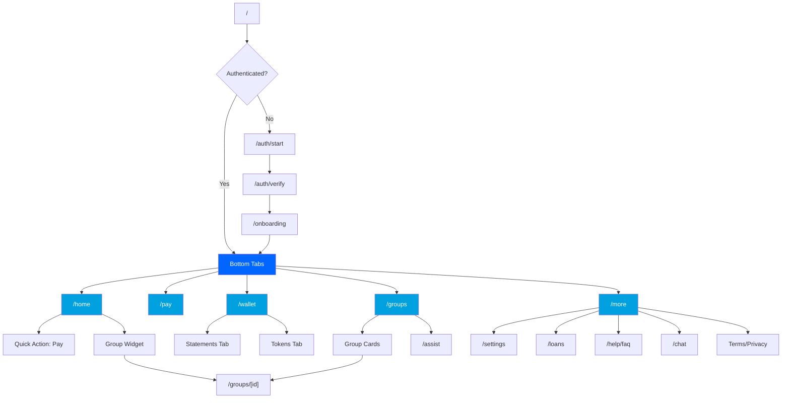

# Information Architecture & Navigation Audit

## Executive Summary

This document analyzes the current information architecture (IA) and navigation
patterns of both the **Client PWA** and **Mobile App**, identifies structural
problems, and proposes a streamlined, Revolut-inspired IA that preserves all
existing features while improving discoverability and time-to-task.

**Key Findings:**

- **PWA**: 23 unique routes with inconsistent grouping; bottom nav shows 5 tabs
  but 8+ feature areas exist
- **Mobile**: Simpler structure (5 tabs + 3 auth screens) but lacks clear
  hierarchy
- **Problems**: Feature-flagged content hidden, duplicate navigation paths, deep
  linking inconsistent
- **Recommendation**: Consolidate to ≤5 primary destinations, use "More" tab for
  secondary features, implement consistent deep linking

---

## Current Information Architecture

### Client PWA (apps/client)

#### Primary Navigation (Bottom Nav - 5 Items)

```
apps/client/components/ui/bottom-nav.tsx
```

1. **Home** (`/home`)
2. **Groups** (`/groups`)
3. **Pay** (`/pay`)
4. **Statements** (`/statements`)
5. **Profile** (`/profile`)

#### Hidden/Secondary Routes (Not in Bottom Nav)

**Auth Routes** (`(auth)` group):

- `/welcome` - Welcome screen
- `/login` - Login/authentication
- `/onboard` - Onboarding form

**Feature Routes** (Not bottom nav):

- `/loans` - Loan products and applications
- `/wallet` - Tokens and vouchers
- `/chat` - AI chat support
- `/support` - Support/help center
- `/pay-sheet` - Expanded payment details
- `/share` - Share functionality
- `/offline` - Offline fallback

**Static/Legal**:

- `/help` - Help center hub
- `/help/faq` - FAQ
- `/help/contact` - Contact support
- `/privacy` - Privacy policy
- `/terms` - Terms of service

**Nested Routes**:

- `/groups/[id]/members` - Group member list

#### Route Tree (Complete)

```
/ (redirects to /home)
├── (auth) [no bottom nav]
│   ├── /welcome
│   ├── /login
│   └── /onboard
├── (tabs) [with bottom nav]
│   ├── /home ★ [Bottom Nav Item 1]
│   ├── /groups ★ [Bottom Nav Item 2]
│   │   └── /groups/[id]/members
│   ├── /pay ★ [Bottom Nav Item 3]
│   │   └── /pay-sheet (separate route, confusingly)
│   ├── /statements ★ [Bottom Nav Item 4]
│   └── /profile ★ [Bottom Nav Item 5]
├── /loans [feature-flagged, no nav entry]
├── /wallet [feature-flagged, no nav entry]
├── /chat [feature-flagged, no nav entry]
├── /support [accessible from profile]
├── /share [PWA share target]
├── /offline [service worker fallback]
├── /help
│   ├── /help/faq
│   └── /help/contact
├── /privacy
└── /terms
```

**Total Routes**: 23 unique pages

---

### Mobile App (apps/mobile)

#### Primary Navigation (Bottom Tabs - 5 Items)

```
apps/mobile/app/(tabs)/_layout.tsx
```

1. **Home** (`/home`)
2. **Pay** (`/pay`)
3. **Statements** (`/statements`)
4. **Offers** (`/offers`) [different from PWA]
5. **Profile** (`/profile`)

#### Other Routes (Outside Tabs)

**Auth**:

- `/auth/start` - Auth start screen
- `/auth/verify` - Verification

**Features**:

- `/assist` - Group join assistance
- `/onboarding` - User onboarding

**Root**:

- `/index.tsx` - Entry redirect

#### Route Tree (Complete)

```
/ (index) → redirects based on auth state
├── /auth
│   ├── /auth/start
│   └── /auth/verify
├── /onboarding
├── (tabs) [with bottom navigation]
│   ├── /home ★ [Tab 1]
│   ├── /pay ★ [Tab 2]
│   ├── /statements ★ [Tab 3]
│   ├── /offers ★ [Tab 4]
│   └── /profile ★ [Tab 5]
└── /assist [floating action button]
```

**Total Routes**: 9 unique screens

---

## Problems Identified

### 1. Inconsistent Feature Visibility

**Problem**: Feature-flagged routes (`/loans`, `/wallet`, `/chat`) exist but
have no navigation entry.

**Impact**: Users unaware these features exist; features orphaned.

**Evidence**:

```typescript
// apps/client/app/loans/page.tsx exists
// But no link in bottom nav or home screen
// Only accessible via direct URL or potential home widget
```

**Example**: User browrows home screen, sees no "Loans" option, doesn't know
feature exists.

---

### 2. Bottom Nav Doesn't Reflect True Primary Tasks

**Problem**: Current bottom nav (Home, Groups, Pay, Statements, Profile) assumes
"Groups" is a top-level action, but user's primary task is "Make a Payment."

**Revolut Pattern**:

- **Home** - Dashboard with balance cards
- **Payments** - Primary action (transfers, bills)
- **Cards** - Manage cards
- **Wealth** - Investments
- **More** - Settings, profile, help

**Proposed for Ibimina**:

- **Home** - Dashboard (group widgets, recent activity)
- **Pay** - Primary action (USSD payment)
- **Wallet** - Statements + Wallet tokens (combined)
- **Groups** - Browse and join groups
- **More** - Profile, Loans, Help, Settings

**Rationale**: Payment is the #1 user task; statements and wallet are related
(viewing money). Groups is secondary browsing.

---

### 3. Duplicate/Confusing Routes

**PWA Problem**: `/pay` AND `/pay-sheet` both exist.

**Evidence**:

- `apps/client/app/(tabs)/pay/page.tsx` - Lists USSD sheets for all groups
- `apps/client/app/pay-sheet/page.tsx` - Expanded single payment view

**Confusion**: Why two separate routes? Should be modal or accordion expansion.

**Solution**: Merge into `/pay` with expandable sections or modal overlay.

---

### 4. Mobile vs PWA Inconsistency

| Feature      | PWA Route           | Mobile Route     | Discrepancy                 |
| ------------ | ------------------- | ---------------- | --------------------------- |
| Groups       | `/groups` (tab)     | No dedicated tab | Mobile has "Offers" instead |
| Offers       | No route            | `/offers` (tab)  | PWA doesn't have            |
| Loans        | `/loans` (hidden)   | Not implemented  | Inconsistent presence       |
| Wallet       | `/wallet` (hidden)  | Not implemented  | Inconsistent                |
| Chat/Support | `/chat`, `/support` | Not implemented  | Different support model     |

**Impact**: Users switching between PWA and mobile confused by different
navigation.

**Solution**: Align both to same 5-tab structure.

---

### 5. Deep Linking & Entry Points Unclear

**PWA Problem**: Many routes exist but no clear entry points.

**Examples**:

- How does user reach `/loans`? Via home widget? Direct link only?
- `/wallet` similarly orphaned
- `/help/faq` vs `/support` - which is primary?

**Solution**: Define explicit entry points:

- Home quick actions
- Profile "More" section
- Feature-flagged routes show in "More" when enabled

---

### 6. Navigation Hierarchy Violations

**Problem**: Some screens have unclear parent-child relationships.

**Example**: `/groups/[id]/members` - Should "Back" go to group detail or groups
list?

- **Current**: Probably groups list (no group detail page)
- **Expected**: Group detail screen with members as tab/section

**Solution**: Add `/groups/[id]` (group detail) with sub-sections: Overview,
Members, Activity.

---

### 7. Settings Scattered

**PWA Problem**: Settings-related actions spread across multiple areas:

- Language selection: Where?
- Notifications: Where?
- Privacy: `/privacy` (legal, not setting)
- Help: `/help`, `/help/faq`, `/help/contact`, `/support` (4 different places!)

**Solution**: Consolidate to `/settings` with sections:

- Account
- Notifications
- Language & Region
- Privacy & Security (links to legal docs)
- Help & Support (links to FAQ, contact)

---

### 8. Mobile Lacks Secondary Navigation

**Problem**: Mobile only has 5 tabs, no "More" or overflow for secondary
features.

**Evidence**: `apps/mobile/app/(tabs)/_layout.tsx` - hardcoded 5 tabs, no
extensibility.

**Revolut Pattern**: 5th tab is "More" with list of secondary features.

**Solution**: Replace "Profile" tab with "More" tab containing:

- Profile
- Settings
- Help & Support
- Legal
- Future feature flags (Loans, Wallet, etc.)

---

## Proposed Information Architecture

### Minimalist 5-Tab Structure (Aligned PWA + Mobile)

```
┌─────────────────────────────────────────────────────────┐
│  [Home]   [Pay]   [Wallet]   [Groups]   [More]         │ ← Bottom Nav
└─────────────────────────────────────────────────────────┘
```

#### 1. Home 🏠

**Purpose**: Dashboard - quick overview and primary actions

**Contents**:

- Welcome message with member name
- Quick action cards: "Pay Now", "View Statements", "Join Group"
- Group savings widgets (top 3 groups)
- Recent confirmations (last 4)
- Floating "Ask to Join" FAB (mobile)

**Routes**:

- PWA: `/home`
- Mobile: `/home`

**Key Actions**:

- Tap "Pay Now" → `/pay`
- Tap "View Statements" → `/wallet` (statements tab)
- Tap "Join Group" → `/groups`
- Tap group widget → `/groups/[id]` (detail)

---

#### 2. Pay 💳

**Purpose**: Primary action - make USSD payments

**Contents**:

- Instructions card (collapsible)
- USSD payment cards for each active group
  - Merchant code
  - Reference token
  - Dial button
  - "I've Paid" button
- Empty state: "Join a group to start contributing"

**Routes**:

- PWA: `/pay`
- Mobile: `/pay`

**Key Actions**:

- Tap "Dial to pay" → Opens phone dialer
- Tap "Copy reference" → Copies to clipboard
- Tap "I've Paid" → Records intent, updates statements

**Design Note**: Remove separate `/pay-sheet` route. Use accordion or modal for
expanded details.

---

#### 3. Wallet 💰

**Purpose**: View money - statements and tokens

**Contents**:

- **Tab 1: Statements** (default)
  - Summary cards: Total, Confirmed, Pending
  - Month filter: This Month, Last Month, Custom
  - Transaction table with status badges
  - Export button
- **Tab 2: Tokens** (if feature flag enabled)
  - Voucher/loyalty points
  - Token cards with balances
  - Redeem action

**Routes**:

- PWA: `/wallet` (with tabs: `?tab=statements` | `?tab=tokens`)
- Mobile: `/wallet` (with segmented control)

**Key Actions**:

- Switch tabs via segmented control
- Filter statements by month
- Tap transaction row → detail modal
- Tap export → CSV download

**Rationale**: Combines "Statements" and "Wallet" from separate routes. Both are
about viewing financial data.

**Migration**:

- Current `/statements` → `/wallet?tab=statements` (or default)
- Current `/wallet` (hidden) → `/wallet?tab=tokens`

---

#### 4. Groups 👥

**Purpose**: Browse, join, and manage group memberships

**Contents**:

- Search/filter bar (proposed)
- Group cards in grid (2 columns mobile, 3-4 desktop)
  - Group name, SACCO name
  - Member count
  - Your savings total
  - Last contribution date
  - Status badge (Active, Pending)
  - "Join" or "View" button
- Floating "Ask to Join" FAB (mobile)
- Empty state: "No groups yet. Tap + to find groups near you."

**Routes**:

- PWA: `/groups` (list), `/groups/[id]` (detail)
- Mobile: `/groups` (list), `/groups/[id]` (detail)

**Key Actions**:

- Tap group card → `/groups/[id]` (detail page)
- Tap "Join" → Join request dialog
- Tap "Ask to Join" FAB → `/assist` (mobile) or inline form (PWA)

**Group Detail Page** (New):

```
/groups/[id]
├── Overview (tab) - Savings summary, contribution schedule, rules
├── Members (tab) - Member list
└── Activity (tab) - Recent transactions
```

**Back Navigation**: Group detail → Groups list

---

#### 5. More ⋮

**Purpose**: Secondary features, settings, profile, help

**Contents**:

```
┌────────────────────────────────┐
│ Your Account                   │
│ ├─ 👤 Profile & Settings       │ → /settings?section=account
│ ├─ 🔔 Notifications            │ → /settings?section=notifications
│ └─ 🌐 Language & Region        │ → /settings?section=language
│                                │
│ Financial                      │
│ ├─ 💵 Loans (if enabled)       │ → /loans
│ ├─ 📱 Reference Card           │ → /reference
│ └─ 📤 Share & Invite           │ → /share
│                                │
│ Help & Legal                   │
│ ├─ ❓ FAQ                      │ → /help/faq
│ ├─ 📞 Contact Support          │ → /help/contact
│ ├─ 💬 Chat with AI (if enabled)│ → /chat
│ ├─ 📄 Terms of Service         │ → /terms
│ └─ 🔒 Privacy Policy           │ → /privacy
│                                │
│ [Log Out]                      │
└────────────────────────────────┘
```

**Routes**:

- PWA: `/more` (new hub page)
- Mobile: `/more` (list screen)

**Key Actions**:

- Tap any item → Navigate to detail page
- Back button → Returns to `/more`
- Log out → Returns to `/welcome`

**Rationale**: Consolidates scattered features into single discoverable
location.

---

## Route Migration Map

### PWA Route Changes

| Current Route   | Proposed Route                        | Change Type     | Notes                    |
| --------------- | ------------------------------------- | --------------- | ------------------------ |
| `/home`         | `/home`                               | **No change**   | Primary tab              |
| `/groups`       | `/groups`                             | **No change**   | Primary tab (position 4) |
| `/pay`          | `/pay`                                | **No change**   | Primary tab (position 2) |
| `/statements`   | `/wallet?tab=statements`              | **Consolidate** | Merged with wallet       |
| `/profile`      | `/more` → `/settings?section=account` | **Restructure** | Now in More tab          |
| `/wallet`       | `/wallet?tab=tokens`                  | **Consolidate** | Merged with statements   |
| `/loans`        | `/more` → `/loans`                    | **Entry added** | Accessible from More     |
| `/chat`         | `/more` → `/chat`                     | **Entry added** | Accessible from More     |
| `/support`      | `/more` → `/help/contact`             | **Consolidate** | Merged with help         |
| `/pay-sheet`    | `/pay` (modal)                        | **Merge**       | Remove separate route    |
| `/help`         | `/more` → `/help/faq`                 | **Restructure** | Default to FAQ           |
| `/help/faq`     | `/help/faq`                           | **No change**   | Accessible from More     |
| `/help/contact` | `/help/contact`                       | **No change**   | Accessible from More     |
| `/privacy`      | `/privacy`                            | **No change**   | Linked from More         |
| `/terms`        | `/terms`                              | **No change**   | Linked from More         |
| `/offline`      | `/offline`                            | **No change**   | Service worker fallback  |
| `/share`        | `/more` → `/share`                    | **Entry added** | Accessible from More     |

**Backward Compatibility**:

- All old routes remain functional
- Add `<meta http-equiv="refresh" content="0;url=/new-route">` for deprecated
  routes
- Or use Next.js `redirect()` in old route files

---

### Mobile Route Changes

| Current Route | Proposed Route                        | Change Type     | Notes                        |
| ------------- | ------------------------------------- | --------------- | ---------------------------- |
| `/home`       | `/home`                               | **No change**   | Primary tab                  |
| `/pay`        | `/pay`                                | **No change**   | Primary tab                  |
| `/statements` | `/wallet?tab=statements`              | **Consolidate** | Merged with wallet           |
| `/offers`     | `/more` → `/offers`                   | **Move**        | Becomes secondary in More    |
| `/profile`    | `/more` → `/settings?section=account` | **Restructure** | Profile now in More          |
| (none)        | `/wallet`                             | **New**         | Combines statements + tokens |
| (none)        | `/groups`                             | **New**         | Add Groups as primary tab    |
| (none)        | `/more`                               | **New**         | Hub for secondary features   |

**New Tab Structure**:

```
[Home]  [Pay]  [Wallet]  [Groups]  [More]
  ★       ★       ★         ★        ★
```

---

## Deep Linking Strategy

### URL Scheme

**PWA**:

- `https://client.ibimina.rw/[route]`

**Mobile**:

- Custom scheme: `ibimina://[route]`
- Universal links: `https://app.ibimina.rw/[route]`

### Supported Deep Links

```
# Authentication
ibimina://welcome
ibimina://login
ibimina://onboard

# Primary tabs
ibimina://home
ibimina://pay
ibimina://wallet
ibimina://wallet?tab=statements
ibimina://wallet?tab=tokens
ibimina://groups
ibimina://more

# Groups
ibimina://groups/[id]
ibimina://groups/[id]?tab=overview
ibimina://groups/[id]?tab=members
ibimina://groups/[id]?tab=activity

# Secondary features
ibimina://loans
ibimina://chat
ibimina://help/faq
ibimina://help/contact
ibimina://settings
ibimina://settings?section=account
ibimina://settings?section=notifications
ibimina://settings?section=language

# Actions
ibimina://pay?groupId=[id]
ibimina://groups/join?saccoId=[id]
```

### Deep Link Handling

**Example**: User receives SMS: "Your payment to Abasigabose group confirmed.
View: https://app.ibimina.rw/wallet?tab=statements&highlight=[txId]"

**Behavior**:

1. Opens app (or installs if not present)
2. Navigates to `/wallet?tab=statements`
3. Scrolls to and highlights transaction `[txId]`

---

## Search & Filters Strategy

### Home Screen

- **No search** (dashboard, no searchable content)
- **No filters** (shows curated overview)

### Pay Screen

- **No search** (shows all user's groups)
- **Possible filter**: "Active groups only" toggle

### Wallet (Statements Tab)

- **Date filter**: This Month, Last Month, Custom (date picker)
- **Status filter**: All, Confirmed, Pending
- **Group filter**: All Groups, [Group 1], [Group 2], ...
- **Search**: Search by amount or notes

### Groups Screen

- **Search bar**: Search by group name or SACCO name
- **Filter chips**:
  - "My Groups" (joined only)
  - "Pending Requests"
  - By SACCO
  - By location (if location data available)
- **Sort**:
  - Alphabetical
  - Member count
  - Recent activity

### More Screen

- **Search**: Quick search for features/settings
- **No filters**

---

## Settings Taxonomy

Proposed structure for `/settings`:

```
Settings
├── Account
│   ├── Personal Information
│   │   ├── Full Name (read-only)
│   │   ├── Phone Number (read-only)
│   │   ├── WhatsApp (editable)
│   │   └── Mobile Money (editable)
│   └── Verification
│       ├── Identity Status
│       └── Upload Documents
├── Notifications
│   ├── Push Notifications (toggle)
│   ├── Payment Confirmations (toggle)
│   ├── Group Invitations (toggle)
│   └── Promotional Offers (toggle)
├── Language & Region
│   ├── Language (Kinyarwanda, English, French)
│   ├── Currency (RWF)
│   └── Date Format (DD/MM/YYYY)
├── Privacy & Security
│   ├── Biometric Login (toggle)
│   ├── PIN Code (set/change)
│   ├── Session Timeout (15min, 30min, 1hr)
│   ├── → Privacy Policy (external link)
│   └── → Terms of Service (external link)
└── Help & Support
    ├── → FAQ
    ├── → Contact Support
    ├── → Chat with AI
    └── App Version (read-only)
```

**Implementation**: `/settings?section=account` → Scrolls to and expands Account
section.

---

## IA Diagrams

### Current PWA IA (ASCII)

```
┌─────────────────────────────────────────────────────────────┐
│                    Bottom Nav (5 tabs)                      │
│  [Home]  [Groups]  [Pay]  [Statements]  [Profile]          │
└─────────────────────────────────────────────────────────────┘
       │        │       │          │            │
       │        │       │          │            └─► Profile details
       │        │       │          │                Settings (none)
       │        │       │          │                Help links
       │        │       │          │
       │        │       │          └──────────────► Statements table
       │        │       │                           Filters
       │        │       │                           Export PDF
       │        │       │
       │        │       └────────────────────────► USSD sheets
       │        │                                   Payment cards
       │        │                                   "I've Paid" action
       │        │
       │        └────────────────────────────────► Groups grid
       │                                            Join dialog
       │                                            /groups/[id]/members
       │
       └─────────────────────────────────────────► Dashboard
                                                    Quick actions
                                                    Group widgets
                                                    Recent confirmations

Orphaned Routes (No Nav Entry):
├── /loans ───────────────────────────────────────► Loan products
├── /wallet ──────────────────────────────────────► Tokens
├── /chat ────────────────────────────────────────► AI chat
├── /support ─────────────────────────────────────► Support
├── /pay-sheet ───────────────────────────────────► Payment detail
└── /help, /help/faq, /help/contact ──────────────► Help pages
```

**Issues**:

- 8+ feature areas crammed into 5 tabs
- No "More" overflow
- Features orphaned or hidden

---

### Proposed PWA IA (ASCII)

```
┌─────────────────────────────────────────────────────────────┐
│                   Bottom Nav (5 tabs)                       │
│  [Home]  [Pay]  [Wallet]  [Groups]  [More]                 │
└─────────────────────────────────────────────────────────────┘
     │       │       │         │         │
     │       │       │         │         └────────────► More Hub
     │       │       │         │                        ├─ Profile & Settings
     │       │       │         │                        ├─ Notifications
     │       │       │         │                        ├─ Language
     │       │       │         │                        ├─ Loans ⭐
     │       │       │         │                        ├─ Reference Card
     │       │       │         │                        ├─ Share & Invite
     │       │       │         │                        ├─ FAQ
     │       │       │         │                        ├─ Contact Support
     │       │       │         │                        ├─ Chat with AI ⭐
     │       │       │         │                        ├─ Terms
     │       │       │         │                        └─ Privacy
     │       │       │         │
     │       │       │         └──────────────────────► Groups
     │       │       │                                   ├─ Search/Filter
     │       │       │                                   ├─ Group Cards
     │       │       │                                   └─ /groups/[id]
     │       │       │                                      ├─ Overview
     │       │       │                                      ├─ Members
     │       │       │                                      └─ Activity
     │       │       │
     │       │       └────────────────────────────────► Wallet
     │       │                                           ├─ Statements Tab ⭐
     │       │                                           │  └─ Filters, Export
     │       │                                           └─ Tokens Tab ⭐
     │       │                                              └─ Vouchers, Points
     │       │
     │       └────────────────────────────────────────► Pay
     │                                                    ├─ Instructions
     │                                                    ├─ USSD Cards
     │                                                    └─ Actions
     │
     └────────────────────────────────────────────────► Home
                                                         ├─ Quick Actions
                                                         ├─ Top 3 Groups
                                                         └─ Recent Activity

⭐ = Consolidates multiple old routes
```

**Benefits**:

- Clear 5-tab hierarchy
- All features discoverable
- Related features grouped (Wallet = statements + tokens)
- More tab accommodates future features

---

### Mobile IA Changes (Mermaid)



---

## 1-3 Tap Analysis

Goal: Core tasks should be reachable within 1-3 taps from home.

### Make a Payment

**Current (PWA)**:

1. Tap "Pay" in bottom nav
2. Scroll to desired group card
3. Tap "Dial to pay"

**Taps**: 3 ✅

**Proposed (PWA)**:

1. Tap "Pay Now" quick action on home (or tap "Pay" in bottom nav)
2. Tap "Dial to pay" on first card

**Taps**: 2 ✅ (improved)

---

### View Statements

**Current (PWA)**:

1. Tap "Statements" in bottom nav

**Taps**: 1 ✅

**Proposed (PWA)**:

1. Tap "Wallet" in bottom nav
2. (Defaults to Statements tab)

**Taps**: 1 ✅ (equivalent)

---

### Join a Group

**Current (PWA)**:

1. Tap "Groups" in bottom nav
2. Scroll to find group
3. Tap group card
4. Tap "Join" button
5. Fill dialog and submit

**Taps**: 5 ❌

**Proposed (PWA)**:

1. Tap "Groups" in bottom nav
2. Search or tap group card
3. Tap "Join" button
4. Submit

**Taps**: 4 (or 2 with quick action: Home → "Join Group" → Search → Join)

**Improvement**: Add "Join Group" quick action on home → direct to groups with
search pre-focused.

**Taps**: 2-3 ✅

---

### Check Loan Options

**Current (PWA)**:

1. Type `/loans` in URL manually

**Taps**: N/A (undiscoverable) ❌

**Proposed (PWA)**:

1. Tap "More" in bottom nav
2. Tap "Loans"

**Taps**: 2 ✅

---

### Change Language

**Current (PWA)**:

1. Tap "Profile" in bottom nav
2. Scroll to find language toggle (if exists?)

**Taps**: 2-3? (unclear)

**Proposed (PWA)**:

1. Tap "More" in bottom nav
2. Tap "Language & Region"
3. Select language

**Taps**: 3 ✅

---

## Migration Notes

### Phase 1: Backend Prep (Week 1)

- Add `/more` route to both apps
- Keep old routes functional (add deprecation notices)
- Implement URL query params for Wallet tabs (`?tab=statements`)

### Phase 2: Component Updates (Week 2)

- Update `bottom-nav.tsx` to show new 5-tab structure
- Add `<SegmentedControl>` to Wallet for tabs
- Create `MoreHub` component with feature list

### Phase 3: Route Redirects (Week 3)

- Add redirects: `/statements` → `/wallet?tab=statements`
- Add redirects: `/profile` → `/more`
- Update all internal links

### Phase 4: Remove Deprecated (Week 4+)

- After 30-day grace period, remove old routes
- Update analytics to track new paths
- Monitor 404s for missed links

---

## Deep Link Priority Matrix

| Link Type        | Priority    | Example                                            | Implementation  |
| ---------------- | ----------- | -------------------------------------------------- | --------------- |
| Payment action   | 🔴 Critical | `ibimina://pay?groupId=123`                        | Must work day 1 |
| View statement   | 🔴 Critical | `ibimina://wallet?tab=statements&highlight=tx-456` | Must work day 1 |
| Group join       | 🟠 High     | `ibimina://groups/123?action=join`                 | Week 1          |
| Loan application | 🟡 Medium   | `ibimina://loans?product=789`                      | Week 2          |
| Help article     | 🟡 Medium   | `ibimina://help/faq?topic=payments`                | Week 3          |

---

## Acceptance Criteria

**Navigation IA must meet**:

- [ ] All primary tasks reachable in ≤3 taps from home
- [ ] Bottom nav has exactly 5 items (Home, Pay, Wallet, Groups, More)
- [ ] All existing features remain accessible (no removed functionality)
- [ ] Feature-flagged routes visible in More tab when enabled
- [ ] Deep links work for all primary and secondary routes
- [ ] Back button navigates to parent consistently
- [ ] Search available on Groups and Wallet screens
- [ ] Settings consolidated to single `/settings` page with sections
- [ ] Help & Support consolidated to single entry point in More
- [ ] PWA and Mobile IA aligned (same 5 tabs)

---

## Next Steps

1. **User Testing**: Show proposed IA to 5-10 users, ask them to complete tasks:
   - "Show me how you would make a payment"
   - "Where would you find your past transactions?"
   - "How would you apply for a loan?"
2. **Analytics Baseline**: Before migration, capture current paths:
   - Most visited pages
   - Average depth from home to task completion
   - Drop-off points

3. **Implementation**: See [12-migration-plan.md](./12-migration-plan.md) for
   detailed rollout.

4. **Measurement**: After migration, compare:
   - Time-to-task metrics
   - Feature discovery rate (% users finding Loans, Wallet)
   - Navigation efficiency (clicks per task)

---

## Appendix: Revolut IA Reference

For comparison, Revolut's structure:

```
[Home] [Payments] [Cards] [Wealth] [More]
  │        │         │        │       │
  │        │         │        │       ├─ Profile
  │        │         │        │       ├─ Settings
  │        │         │        │       ├─ Security
  │        │         │        │       ├─ Help
  │        │         │        │       └─ ... (10+ items)
  │        │         │        │
  │        │         │        └─► Stocks, Crypto, Savings
  │        │         │
  │        │         └─► Card management, ATM finder
  │        │
  │        └─► Transfers, Requests, Bills
  │
  └─► Accounts, Transactions, Analytics
```

**Key Takeaways**:

- 5 tabs, last is "More" (overflow)
- Primary action ("Payments") is tab 2
- Financial viewing ("Home") is tab 1
- Everything else in "More"
